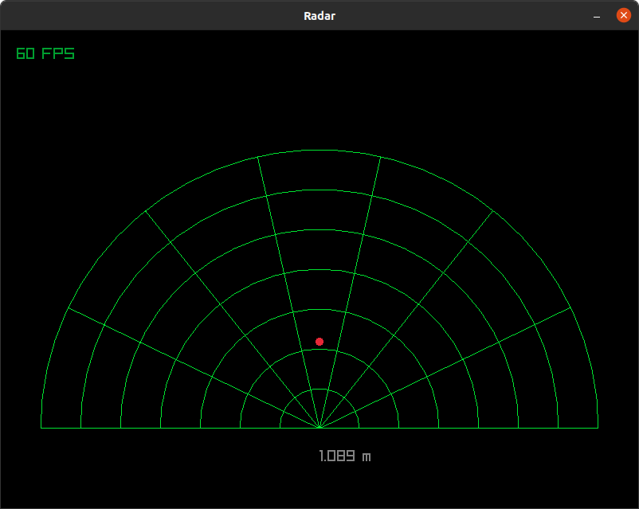
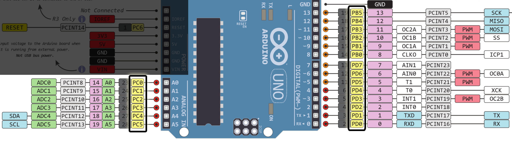

# Radar

There are 2 programs, one for the arduino and the other is the GUI to visualize the near obstacles.
- Arduino program uses the ultrasonic ranging module HC-SR04 with the connection of the pins indicated below,
- Gui program needs the path "/dev/ttyACM0" as a parameter to start.


## Ready to start

_To compile & upload into the arduino_

```console
$ make all
$ make dude
```

_To start the GUI_

```console
$ make all
$ ./main /dev/ttyACM0
```

### Tips for debugging

_To read data from arduino without GUI program:_
```console
$ screen /dev/ttyACM0 1000000
```

_To quite screen:_
```concole
$ C-a C-k y
```

_Tip to save the terminal config_

```console
$ screen /dev/ttyACM0 1000000
$ stty -g -F /dev/ttyACM0 > confTTY.txt
```

_Tip to restaure the terminal config for GUI_

```console
$ stty -F /dev/ttyACM0 $(cat confTTY.txt)
```

- stty -a -F /dev/ttyACM0 will show the current config in readable format
- stty -g -F /dev/ttyACM0 will show the current config in compatible format


## connections

|  HC-SR04  |    Arduino    |
|-----------|---------------|
|   Vcc     |      5v       |
|   GND     |     GND       |
|   Trig    |   PB2(~10)    |
|   Echo    | PB0(PCINT0 8) |


## Exemples:

[](/picture)


## Datasheet

[](/picture)


## References:

_HC-SR04 datasheet_
- https://cdn.sparkfun.com/datasheets/Sensors/Proximity/HCSR04.pdf

_ATmega328p datasheet_
- https://ww1.microchip.com/downloads/en/DeviceDoc/Atmel-7810-Automotive-Microcontrollers-ATmega328P_Datasheet.pdf

_Help to read on serial ports_
- https://blog.mbedded.ninja/programming/operating-systems/linux/linux-serial-ports-using-c-cpp/
